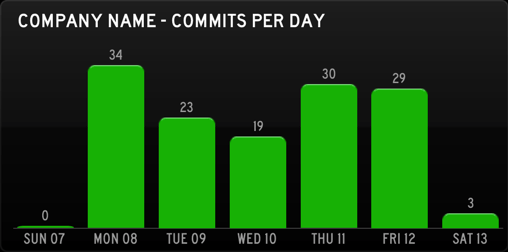

# About
CVS Status Board generates a graph of CVS commit statistics for use in Panic's [Status Board](http://panic.com/statusboard/) iPad app.



The script can be run manually or with the use of a cron job. It supports both local and remote CVS repositories, via SSH. Accessing remote repositories requires key-based authentication. It is not possible to use password-based authentication at this time.

# Configuration
**NOTICE:** This configuration format is likely to change in the future to support multiple types of output graphs (by author, by week, by month, etc).

Create a configuration file named `config.yml`. A `config-example.yml` is provided to help you get started.

```yaml
server      : user@server
repo_path   : .
title       : MyCompany
color       : blue
export_path : ~/Dropbox/Public/statusboard
```

* **server** — The server to connect to via SSH, including a user (if required). If you are generating stats for a local repository, enter "localhost" or leave blank.
* **repo_path** — The path to your CVS repository. Please be sure to escape spaces and other characters that are not `cd` friendly.
* **title** — The title used to differentiate one graph from another. This will be displayed as "YOURTITLE - COMMITS PER DAY".
* **color** — The color to use for the graph.
* **export_path** — The path to export the resulting JSON file. We suggest a service such as Dropbox. To use, just copy the file's public URL.

# MIT License (MIT)
Copyright (c) 2013 Matthew Price, http://mattprice.me/

Permission is hereby granted, free of charge, to any person obtaining a copy of this software and associated documentation files (the "Software"), to deal in the Software without restriction, including without limitation the rights to use, copy, modify, merge, publish, distribute, sublicense, and/or sell copies of the Software, and to permit persons to whom the Software is furnished to do so, subject to the following conditions:

The above copyright notice and this permission notice shall be included in all copies or substantial portions of the Software.

THE SOFTWARE IS PROVIDED "AS IS", WITHOUT WARRANTY OF ANY KIND, EXPRESS OR IMPLIED, INCLUDING BUT NOT LIMITED TO THE WARRANTIES OF MERCHANTABILITY, FITNESS FOR A PARTICULAR PURPOSE AND NONINFRINGEMENT. IN NO EVENT SHALL THE AUTHORS OR COPYRIGHT HOLDERS BE LIABLE FOR ANY CLAIM, DAMAGES OR OTHER LIABILITY, WHETHER IN AN ACTION OF CONTRACT, TORT OR OTHERWISE, ARISING FROM, OUT OF OR IN CONNECTION WITH THE SOFTWARE OR THE USE OR OTHER DEALINGS IN THE SOFTWARE.
